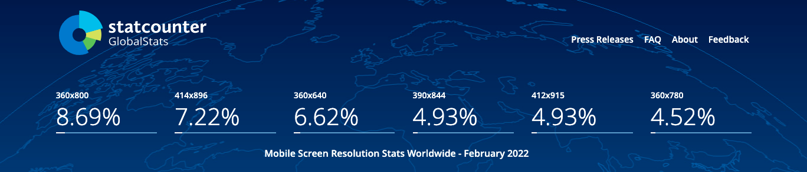

# Flutter Responsive Design

Learning responsiveness in flutter application. 
Video URL: https://www.youtube.com/watch?v=MrPJBAOzKTQ&list=LL&index=3&t=2s

## Device Regulations from [Statcounter](https://gs.statcounter.com/screen-resolution-stats/mobile/worldwide)

## Getting Started

 

